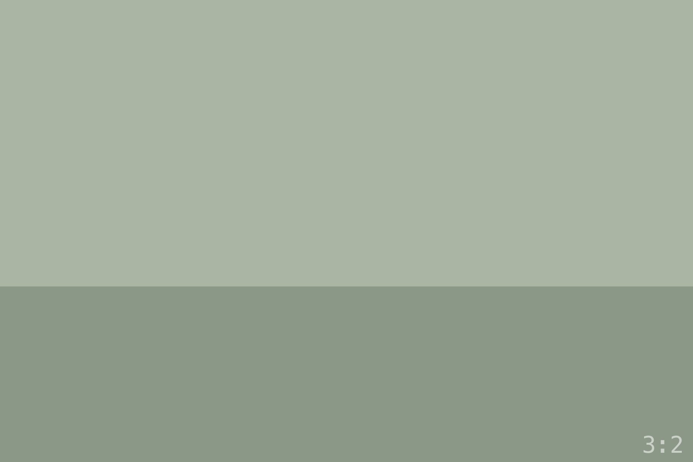
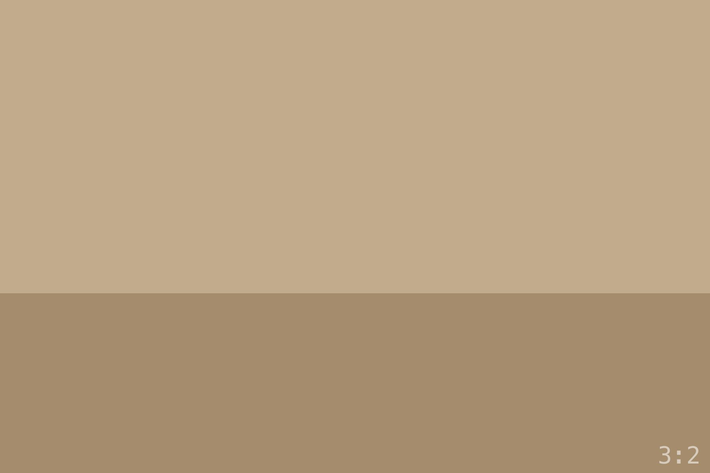

A plain markdown image, previewed natively by Obsidian:

Leaf forms — the plugin shows the image:

::single{src="./land-b.jpg" alt="Single"}

::wide{src="./land-c.jpg" alt="Wide"}

::tall{src="./port-a.jpg" alt="Tall"}

::inset{src="./square.jpg" alt="Inset"}

::fullbleed{src="./pano.jpg" alt="Fullbleed"}

::diptych{left="./land-c.jpg" right="./port-b.jpg" leftAlt="Left" rightAlt="Right"}

::triptych{left="./land-a.jpg" center="./square.jpg" right="./port-a.jpg" leftAlt="Left" centerAlt="Centre" rightAlt="Right"}

Container forms — raw text in Live Preview, a caption on the site:

:::wide{src="./land-b.jpg" alt="Wide with a caption"}
The caption under the frame.
:::

The three blocks that take stages — the plugin shows the stages' images with their labels:

:::compare{mode="filmstrip"}
 The RAW file straight out of camera — no edits, no adjustments.
 Shadows lifted on the ridge, the fog's highlights held.
 A touch of warmth over the whole frame.
:::

:::side
 Straight out of the camera.
 The print.
:::

:::slider
 Straight out of the camera.
 The print.
:::

Raw by design in the plugin (`grid`, `strip`, `aside`, `row`, `held`):

:::grid

The grid's caption.
:::

:::held{src="./land-b.jpg" alt="Held" side="right"}
Prose beside a held frame.

More prose.
:::
