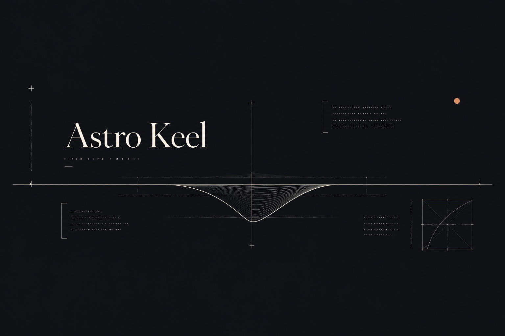

Out the door at five, coffee in a thermos, and down to the jetty while
the sky was still deciding what color it wanted to be. This piece
exists to prove the authoring loop works — written as plain Markdown in
the pieces folder, validated by the collection schema, rendered by the
site build — but the walk was real enough.

::fullbleed{src="./jetty-dawn.jpg" alt="The full sweep of the jetty at dawn, edge to edge"}

The light came up faster than expected. Ten minutes of that soft
blue-hour gradient, then the sun cleared the horizon and flattened
everything. The usual lesson: arrive earlier than feels reasonable.

Two frames from the same ten minutes, side by side — the pairing is
the point, which is what the diptych treatment is for:

::diptych{left="./jetty-dawn.jpg" right="./jetty-dawn.jpg" leftAlt="The jetty before sunrise, cool and blue" rightAlt="The same view minutes later, first warmth on the horizon"}

This piece now exercises the full built vocabulary: prose, a plain
single image, a full-bleed, and a diptych. Only `sequence` remains
reserved for a future design pass.
