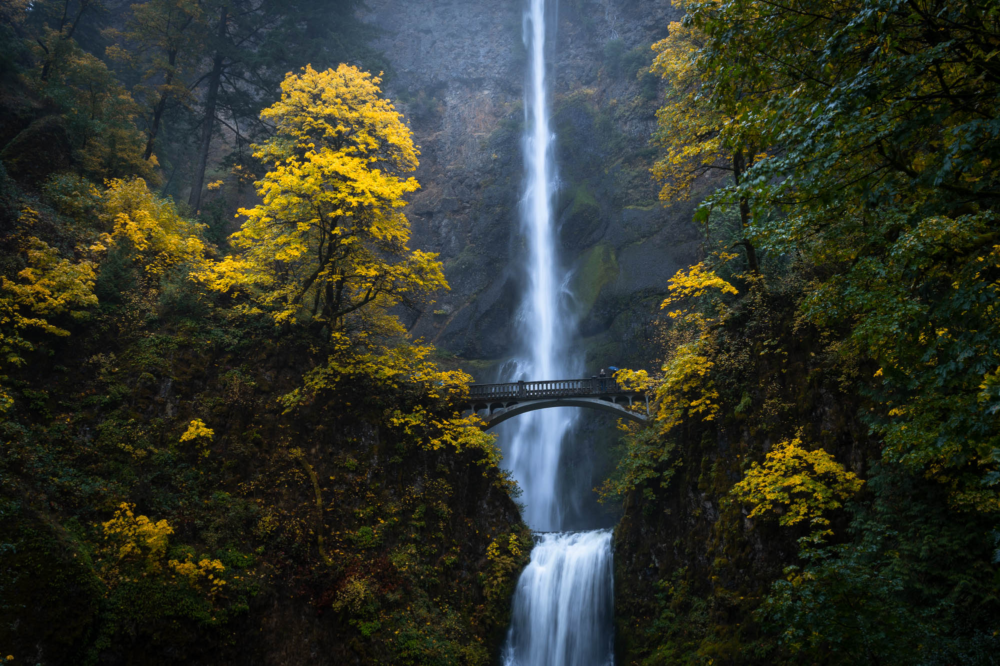
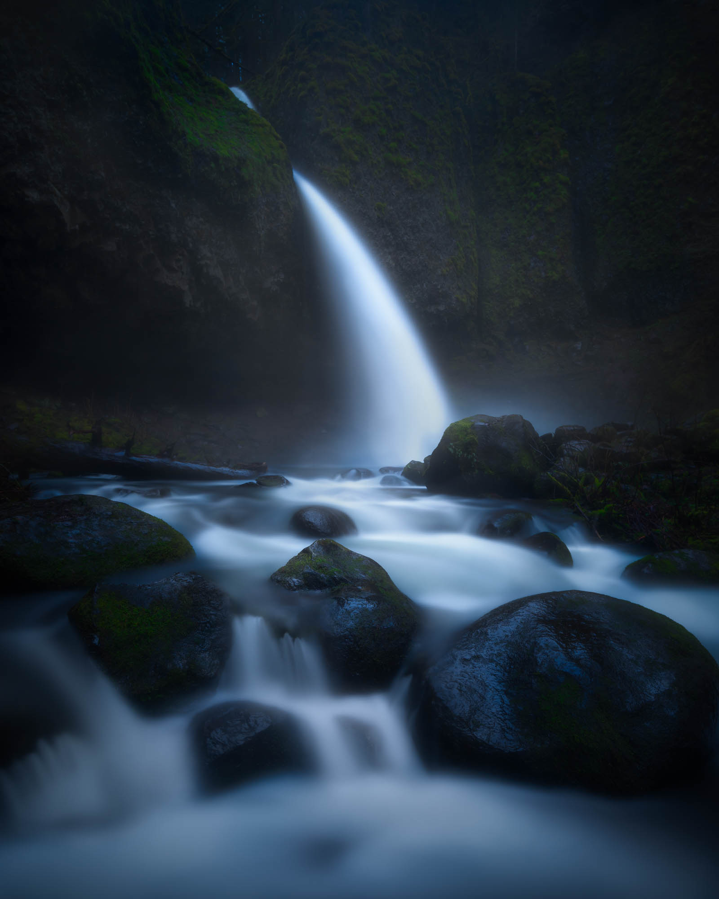
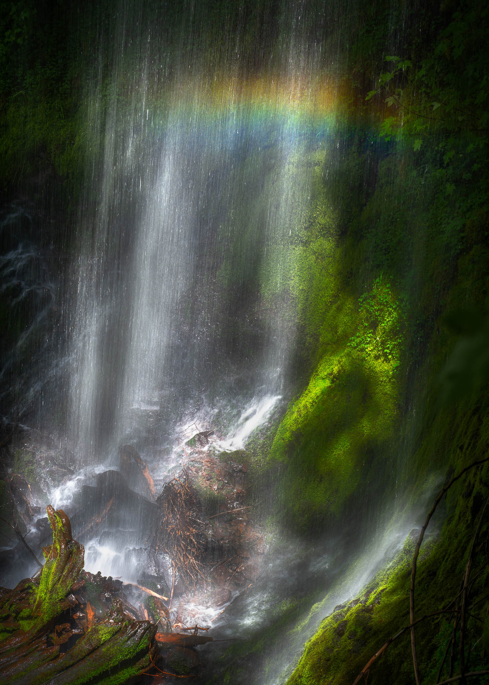
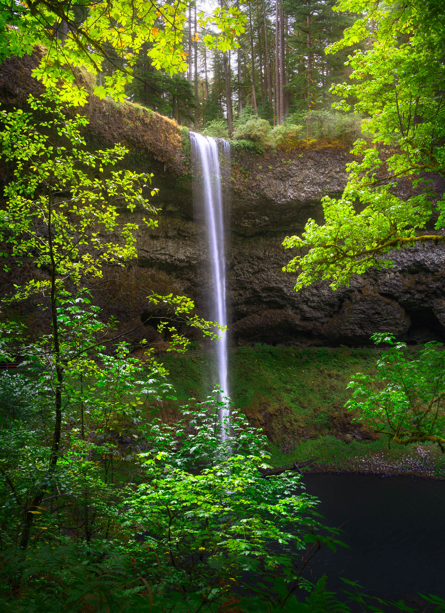
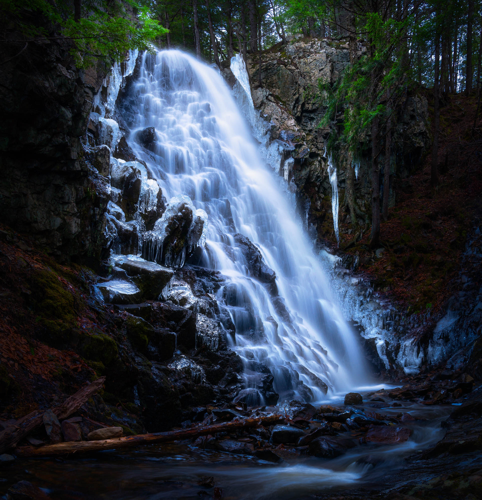
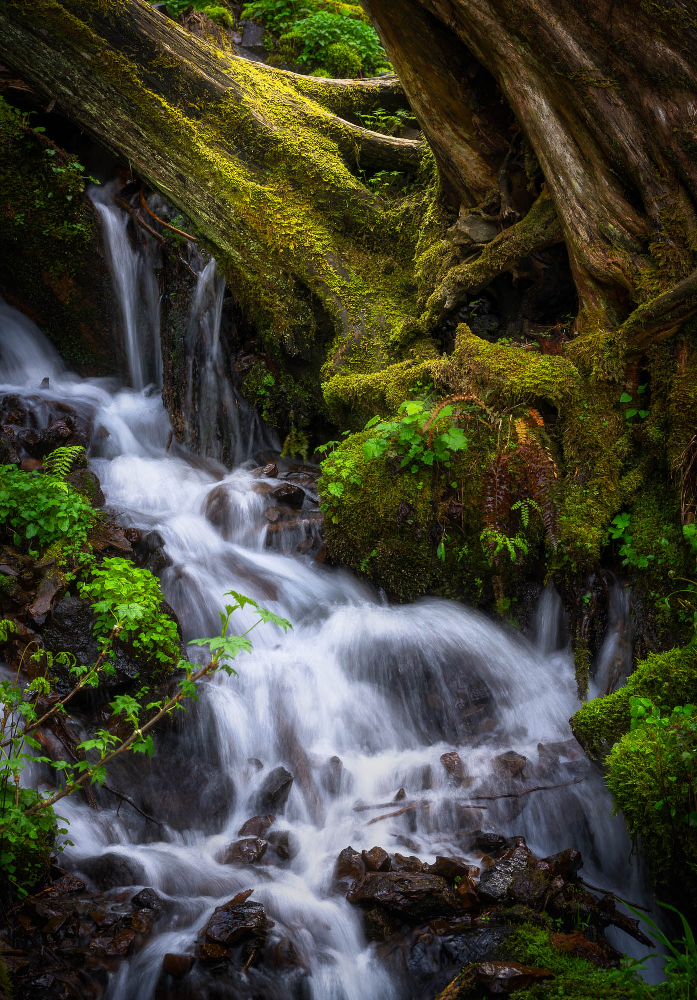

This fixture exists for one decision: how wide a mat should be. Every
block below borrows a photograph from the gallery root by its spec-008
path, so the fixture owns no image of its own and ships nothing. The
matted treatments come in the order the mat rule's forms do; the three
unmatted ones — fullbleed, tall, strip — sit between them as controls,
so a mat that has crept onto one of them is visible in the same scroll.

## The shorthand

Plain markdown, no caption — the image the transform mats through the
paragraph, not through a block wrapper.

The frame above fills the reading column, so its mat is a share of the
rendered short side of a three-by-two photograph at that width.

## Single

The directive form at the same width. This is the frame the plan's
numbers are quoted on: a 3:2 photograph in a 666-pixel column.

::single{src="../../gallery-images/latourelle-gold.jpg" alt="Latourell Falls in low gold light"}

Below it the inset — the same rule on a smaller frame, which is the
whole point of a share: a narrower frame should wear a narrower mat.

## Inset

::inset{src="../../gallery-images/water-and-ice.jpg" alt="Ice forming at the edge of moving water"}

A sentence between the blocks, so the page reads as a page rather than
a contact sheet.

## Fullbleed — a control

Edge to edge, and deliberately unmatted. If a mat appears here, the
rule has reached a frame it was never meant to reach.

::fullbleed{src="../../gallery-images/two-medicine-twilight.jpg" alt="Two Medicine Lake at twilight"}

## Wide

The centred breakout: wider than the prose, short of the viewport.

::wide{src="../../gallery-images/multnomah-gold.jpg" alt="Autumn light across the face of Multnomah Falls"}

Half-bleed to the left — the bled edge runs clean to the viewport and
the mat holds on the other three sides.

::wide{src="../../gallery-images/two-medicine-twilight.jpg" alt="Two Medicine Lake at twilight" bleed="left"}

## Tall — a control

A vertical capped below the viewport's height, unmatted like fullbleed.

::tall{src="../../gallery-images/those-fall-feelings.jpg" alt="A creek running through autumn colour"}

## Diptych

The default pair: equal widths, mixed orientations centred on the
midline, each frame on its own mat. The landscape and the portrait
render at different heights here, so their mats may differ.

::diptych{left="../../gallery-images/multnomah-gold.jpg" right="../../gallery-images/cozy-brook.jpg" leftAlt="Autumn light on Multnomah Falls" rightAlt="A small brook under moss and fern"}

The same pair matched on height — one mat for the whole block, a share
of the matched height. Both members should wear the same mat and stand
at the same height.

::diptych{left="../../gallery-images/multnomah-gold.jpg" right="../../gallery-images/cozy-brook.jpg" leftAlt="Autumn light on Multnomah Falls" rightAlt="A small brook under moss and fern" match="height"}

## Triptych

Three frames matched on height, two verticals against a horizontal —
the block where one mat over the whole row is easiest to read.

::triptych{left="../../gallery-images/latourelle-gold.jpg" center="../../gallery-images/those-fall-feelings.jpg" right="../../gallery-images/two-medicine-twilight.jpg" leftAlt="Latourell Falls in low gold light" centerAlt="A creek running through autumn colour" rightAlt="Two Medicine Lake at twilight" match="height"}

## Strip — a control

The band scrolls sideways and the frames keep their height. Unmatted,
by the vocabulary's rule.

:::strip

:::

## Grid

Four frames in a cluster, each on its own mat, with the caption
spanning the grid.

:::grid

Four frames at the same column width, each with its own rendered short
side — the cluster where a share should read as four different mats.
:::

## Aside

:::aside{src="../../gallery-images/mystic-falls.jpg" alt="Mystic Falls through spring growth" side="left"}
The prose wraps around the floated figure, which needs enough words to
actually wrap: the aside carries commentary tied to one photograph,
and the mat has to survive the text running past its edge without
looking like a gap in the paragraph. A second sentence gives the wrap
the room it needs to show itself, and a third keeps the float from
clearing before the eye has seen the mat against the words.
:::

## Row

:::row{src="../../gallery-images/lower-falls-spring.jpg" alt="The lower falls in spring" side="right"}
The row keeps the photograph and the prose in separate columns — no
wrap, the frame top-aligned beside the words. A mat here sits between
the picture and a column of text rather than between the picture and
the page, which is the harder case to judge.
:::

## Held

The held frame parks at the top margin while the writing passes it,
which makes it the one reading-flow frame whose height, not the
column's width, decides its size. A portrait runs to the full hold
height on a laptop, so its mat comes from the height form rather than
the width form.

:::held{src="../../gallery-images/latourelle-glow.jpg" alt="Latourell Falls glowing through the trees"}
Words for the frame to hold. A vertical at the full hold height needs
a long column beside it before the hold releases, and this paragraph
is the first of the eight that give it one. The frame is sized from
its own ratio and the height it is allowed, never from the image's
size hint.

The mat on a held frame is the height form's answer: a share of the
rendered short side, which for a vertical at full height is its width.
The anchor inside the figure solves the same number from the width it
has been given, and the two must agree — that agreement is what the
gate is looking at here.

The reading column keeps a forty-four character measure whatever the
frame does, so these paragraphs run longer on the page than they look
in the source. That extra length is the hold's length: the writing
outlasts the frame, and the frame lets go with the last line.

Somewhere around here the prose passes the bottom of the frame. If the
writing were shorter than the picture, nothing would hold at all — the
figure would sit in the flow with the words beside it, which is what
happens on a phone.

A wider mat makes the frame wider without making it taller: the height
is fixed by the viewport, so the mat grows outward into the column's
share of the grid. At the largest share on the smallest laptop that is
the change worth watching for.

The header is away while a frame is held, whichever way the reader
scrolls, so the frame may use the whole height and the mat has the
whole height's short side to take its share of.

Nothing here moves by script. The hold is a sticky figure; the piece
page's script only marks that a frame is parked, and this fixture
renders no script at all — the mats are the whole of what it shows.

The last paragraph, and the release. The frame travels away with this
line and the next block starts at an ordinary block margin, with no
empty stage between the final sentence and what follows.
:::

## Pause

A frame too wide to hold beside words arrives below the last paragraph
and pins at the centre, with this paragraph anchored above it for the
whole of the pinned stretch. In the sampler the lights never go down —
there is no script here — so the frame and its mat are judged on the
light ground, which is where a mat is hardest to see.

::pause{src="../../gallery-images/pano-3x1-01.jpg" alt="A wide panorama, the widest frame the vocabulary places"}

The paragraph on the far side of the frame, anchored below it, and the
end of the fixture. Every matted treatment above wears the mat the
three tokens produce; the three controls wear none.
