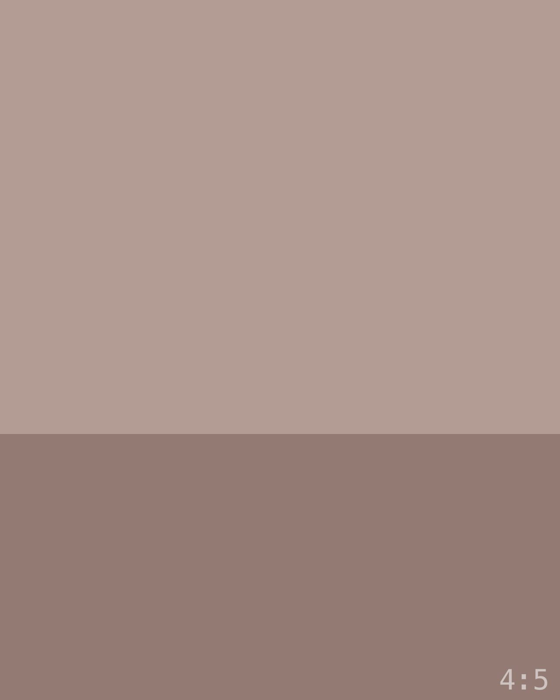
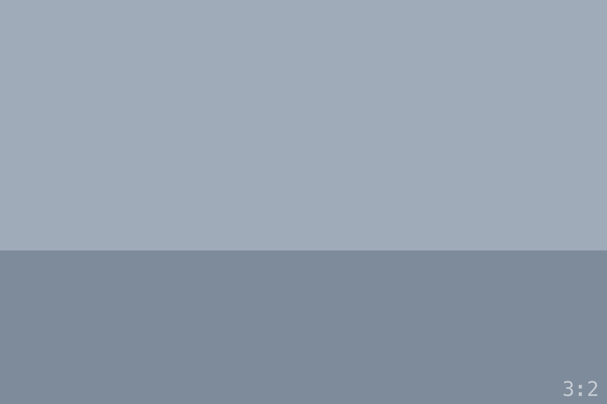
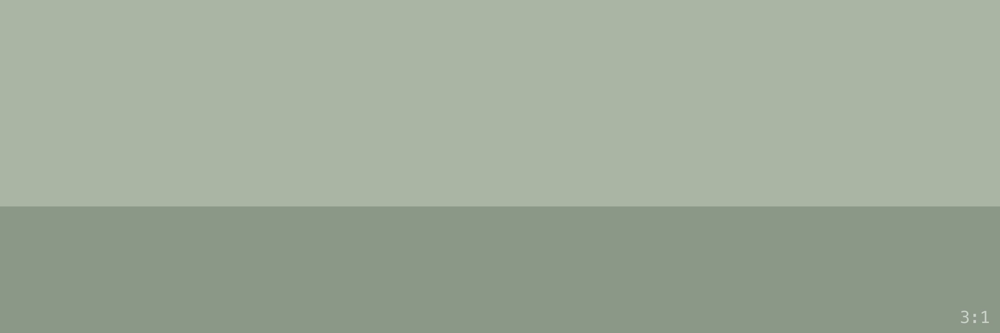
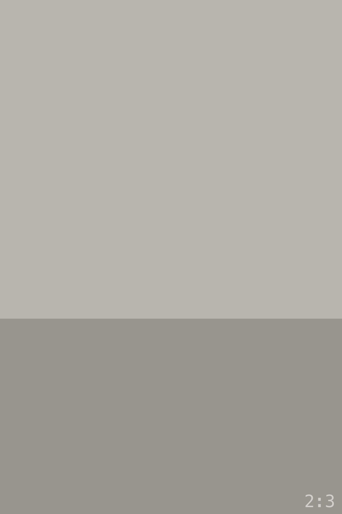
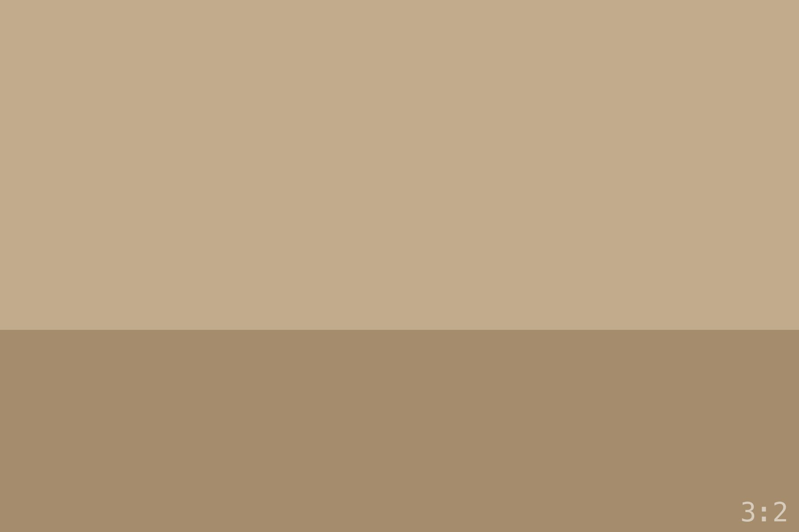

This fixture exercises the whole closed vocabulary in order. Each
section shows a treatment's leaf form, its captioned container form,
and its attributes. The images are generated placeholders labeled with
their aspect ratios.

## Single

The shorthand — plain markdown, no caption:

The directive form, identical width:

::single{src="./land-b.jpg" alt="A 3:2 placeholder"}

And captioned:

:::single{src="./land-c.jpg" alt="A 3:2 placeholder"}
A caption with _inline markdown_ — the container body.
:::

## Inset

::inset{src="./square.jpg" alt="A square placeholder"}

:::inset{src="./square.jpg" alt="A square placeholder"}
Narrower than the text, centered. For detail shots.
:::

## Wide

::wide{src="./land-a.jpg" alt="A 3:2 placeholder"}

:::wide{src="./land-b.jpg" alt="A 3:2 placeholder"}
The centered breakout — wider than the prose, short of the viewport.
:::

Half-bleed, left and right:

::wide{src="./land-c.jpg" alt="A 3:2 placeholder" bleed="left"}

::wide{src="./land-a.jpg" alt="A 3:2 placeholder" bleed="right"}

## Fullbleed

::fullbleed{src="./land-a.jpg" alt="A 3:2 placeholder"}

:::fullbleed{src="./land-b.jpg" alt="A 3:2 placeholder"}
Viewport edge to edge; the caption returns to the column.
:::

## Tall

::tall{src="./port-b.jpg" alt="A 2:3 placeholder"}

:::tall{src="./port-a.jpg" alt="A 2:3 placeholder"}
Capped below the viewport's height — the vertical counterpart to
fullbleed.
:::

## Diptych

Default — equal widths, mixed orientations centered on the midline:

::diptych{left="./land-a.jpg" right="./port-a.jpg" leftAlt="Landscape" rightAlt="Portrait"}

Captioned:

:::diptych{left="./land-b.jpg" right="./land-c.jpg" leftAlt="Left frame" rightAlt="Right frame"}
Two matched frames, each on its own mat.
:::

Equal heights — widths follow the aspect ratios:

::diptych{left="./land-a.jpg" right="./port-b.jpg" leftAlt="Landscape" rightAlt="Portrait" match="height"}

Weighted, left then right:

::diptych{left="./land-b.jpg" right="./port-45.jpg" leftAlt="Dominant" rightAlt="Companion" weight="left"}

::diptych{left="./port-45.jpg" right="./land-c.jpg" leftAlt="Companion" rightAlt="Dominant" weight="right"}

Width variants — the pair breaks out to the content width, then the
viewport (mats drop at fullbleed; edge-to-edge is the point):

::diptych{left="./land-a.jpg" right="./land-b.jpg" leftAlt="Left" rightAlt="Right" width="wide"}

::diptych{left="./land-c.jpg" right="./port-a.jpg" leftAlt="Left" rightAlt="Portrait" width="fullbleed"}

## Triptych

Horizontal–vertical–horizontal on the midline:

::triptych{left="./land-a.jpg" center="./port-a.jpg" right="./land-b.jpg" leftAlt="H" centerAlt="V" rightAlt="H"}

Equal heights:

::triptych{left="./land-c.jpg" center="./port-b.jpg" right="./square.jpg" leftAlt="H" centerAlt="V" rightAlt="S" match="height"}

Triptych at the content width, then the viewport:

::triptych{left="./land-a.jpg" center="./port-b.jpg" right="./land-c.jpg" leftAlt="H" centerAlt="V" rightAlt="H" width="wide"}

::triptych{left="./land-b.jpg" center="./port-a.jpg" right="./land-a.jpg" leftAlt="H" centerAlt="V" rightAlt="H" width="fullbleed"}

## Grid

:::grid

A four-image cluster with a caption spanning the grid.
:::

## Strip

A single panorama:

:::strip

The band scrolls sideways; the pano keeps its height.
:::

A filmstrip:

:::strip

:::

## Aside

:::aside{src="./port-45.jpg" alt="A 4:5 placeholder" side="left"}
The prose wraps around the floated figure. This paragraph needs enough
words to actually wrap: the aside is for commentary tied to one image,
where the text should flow past the frame rather than sit locked
beside it. A second sentence gives the wrap room to show itself.
:::

:::aside{src="./port-45.jpg" alt="A 4:5 placeholder" side="right"}
The same treatment mirrored. Floats clear before the next block.
:::

## Row

:::row{src="./port-a.jpg" alt="A 2:3 placeholder" side="left"}
The row keeps image and prose in separate columns — no wrap. Longer
text sits beside the frame, top-aligned, and the pair collapses to a
stack on phones.
:::

:::row{src="./land-a.jpg" alt="A 3:2 placeholder" side="right"}
Mirrored, image on the right.
:::

## Held

The held image: the frame stays fixed at the top margin
while the body's paragraphs pass beside it, and lets go exactly when
the last line passes. The hold lasts as long as the writing outlasts
the frame, so a body shorter than the frame never holds. A landscape
frame has no column beside it on a portrait screen, and nothing holds
on a phone — the frame is static there with its words after it.

:::held{src="./land-b.jpg" alt="A 3:2 placeholder"}
Sample prose, to give the hold something to hold. A held image at the
content width, frame on the left, five paragraphs beside it — the
calibration for a landscape frame on a laptop screen: enough words to
outlast the frame, not so many the hold overstays.

The frame is sized from its own ratio and the space it has — the
column or the hold height, whichever is tighter — never from the
image's own size hint: on this screen the column governs this 3:2,
while a 2:3 beside its words runs to the full hold height, and the
prose column keeps its 44-character measure either way.

The first paragraph meets the top of the frame. The reading column is a
narrow measure, so these paragraphs run longer on the page than they
look in the source, which is the point — the scroll they add is the
hold's length.

Somewhere around here the prose passes the bottom of the frame. If the
frame were taller than the words, nothing would hold; the frame would
simply sit in the flow with the words beside it.

The last line is the release. There is no air after it: the scene ends
where the prose ends and the next block's margin begins, so the frame
travels away with the final sentence rather than lingering.
:::

:::held{src="./port-a.jpg" alt="A 2:3 placeholder" side="right" bleed}
Sample prose, for a held image bled to the right edge — the frame on
the right, running to the viewport's edge, the prose keeping its
column. A full-height vertical needs eight paragraphs to outlast it.

A portrait frame uses the whole hold height on a landscape screen, so
it is tall and narrow beside a column that is itself narrow. The words
have further to travel.

On a portrait screen the same frame keeps its side: there is a column
beside a vertical frame there, which is exactly what a landscape frame
lacks. The orientation class on the wrapper says which case this is,
decided at build time from the image's own pixels.

The bleed is a flag, not a side: it takes the side the frame already
has and runs it out to the edge. The matte hugs the frame either way.

The header goes away while a frame is held, whichever way the reader
scrolls, so a scroll back up through the hold does not drop the site's
chrome across the top of the picture.

Nothing here moves by script. The hold is a sticky figure; the script
on the piece page only marks that a frame is parked, which is what
keeps the header away. The lights belong to a pause.

This paragraph exists to lengthen the scene. So does the next. The
release is where the words end, and eight paragraphs is what a
full-height vertical takes at a laptop's viewport.

The last paragraph. The frame lets go with this line and the section
below begins at an ordinary block margin — no held stretch, no empty
stage between the last word and the next thing.
:::

## Pause

The pause: a frame too wide to hold beside words arrives an ordinary
figure's margin below the last paragraph and pins at the centre, and
this paragraph and the one on the far side of the frame pin with it,
anchored above and below the photograph for the whole of it. The
page's lights go down to a dark grey — the words a shade darker,
still faintly readable, the mat keeping its white — and up again
before the page moves on; the frame comes a little closer at the
middle. Script-driven; without it the frame pins on the light ground.

::pause{src="./pano.jpg" alt="A 3:1 placeholder"}

Sample prose after the pause, carrying an inline link to [the sampler
itself](/pieces/vocabulary-sampler/) — the lights list's check: a link
inherits its paragraph's colour, so it fades with the words rather than
standing out on the dark ground.

## After the pause

A heading follows, for the same check: headings mix from their own
token, so this one fades in step with the paragraphs rather than
snapping to a different shade when the lights go down.

Sample prose, and here for a structural reason as much as a stylistic
one: a pause finishes only when the end of its scene catches up with
the pinned stage, which needs about half of the screen the stage
leaves empty in document after it. Without words down here the piece would end while the lights were still part
of the way up, which is what a measurement on a portrait desktop found
before these paragraphs were written.

One more, for the same reason: on a tall viewport that room is more
than a single paragraph carries, and the need grows with the screen
while the words do not. The sampler closes on words rather than on
the frame, which is the rule every piece follows — never end with a
pause.

And a third, so the margin is comfortable rather than exact: a taller
window asks for more room below the pause than the last measurement
did, and a fixture that only just clears its own rule is a fixture
waiting to fail.
