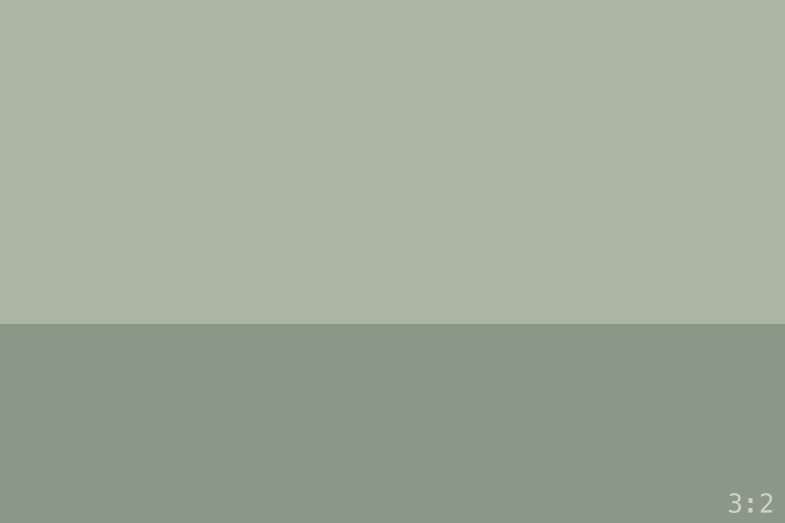

The forecast said the fog would burn off by eight. The fog had not
read the forecast. I walked the headland trail in a gray that swallowed
the ocean whole, tripod over my shoulder, and told myself that gray is
a color too.

By half past, the first seams opened. This is the part I never manage
to explain: the fog doesn't lift so much as _let go_ — it releases the
ridgeline first, then the water, and for about ten minutes everything
exists in both states at once.

:::wide{src="./land-b.jpg" alt="The ridgeline emerging from fog, water still hidden"}
The ten minutes. Ridgeline out, ocean still undecided.
:::

I worked fast. Two frames from the same spot, three minutes apart —
the pair says more than either alone:

:::diptych{left="./land-c.jpg" right="./port-b.jpg" leftAlt="The cove while the fog held" rightAlt="The same cove as the sun found it"}
Same cove, three minutes apart. The vertical earns its height.
:::

The light that follows a marine layer has no equivalent. It arrives
pre-softened, like the whole sky became one enormous diffuser, and for
a while every direction is the good direction.

:::tall{src="./port-a.jpg" alt="A sea stack lit top to bottom in post-fog light"}
The sea stack, top to bottom — the frame that needed to stand up.
:::

From the top of the bluff the whole coastline unrolled, too wide for
any column:

:::strip

Drag sideways — the pano keeps its height and takes its length.
:::

By ten the light was ordinary again and the parking lot was full. The
morning belonged to the people who came early and stood in the gray
without knowing if it would open.

::fullbleed{src="./land-b.jpg" alt="The headlands in full light, edge to edge"}
